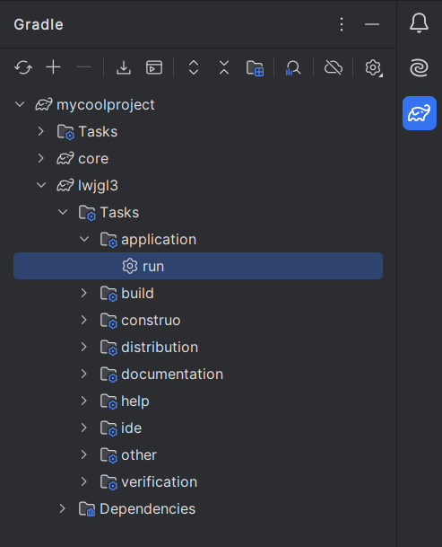

# Bomberman Game

Bomberman is an arcade-style maze-based video game using Libgdx.

## Set up and getting it running
1. First, clone this project.
2. Open your favourite IDE, if you are using IntelliJ, just click the file build.gradle and choose: "Open as project".
3. Run this command on terminal to run this game as desktop app
```bash
./gradlew lwjgl3:run
 ```
or simple run Gralde at the top right of IDE:

